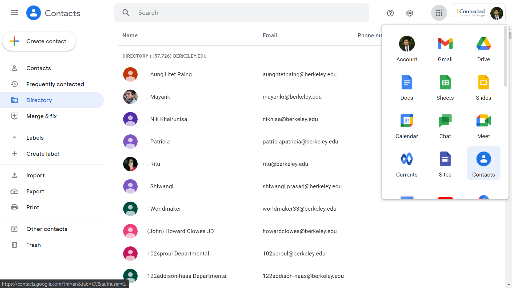
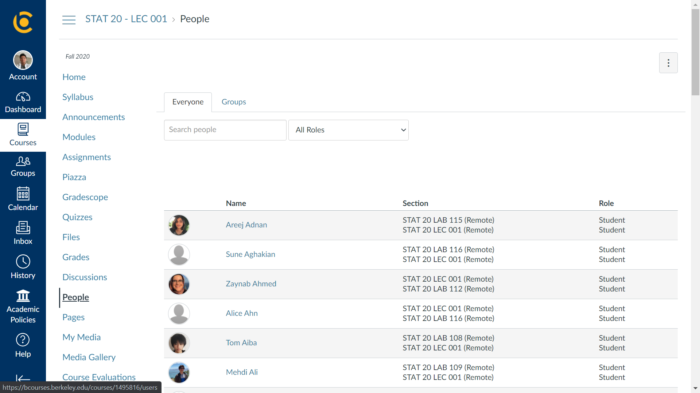

# VC Recruiting

There are two parts to the tech side of recruiting. 

#### Contacts

First, we want to gather an up-to-date list of all Berkeley emails. There's a fairly easy but time-consuming way to do this.

1. Log in to your Berkeley gmail.

2. Underneath apps, click on "contacts" and go to the [directory](https://contacts.google.com/u/0/directory).

3. Open Developer Tools ("More tools" -> "Developer tools" or Ctrl+Shift+I). Open the Console.

   

4. Open the ``scraper.js`` file and paste the script in the console.

5. Press enter. The screen should start scrolling down. The Console output will report the progress. The process should take around an hour. Note: if it looks like the names aren't loading, that's not good. Set a greater sleep value, something like 2000.
6. When you reach the bottom of the page and the script finishes, run the following int he console: ``JSON.stringify(Array.from(exportedContactsStorage))``. It should print out a long string that you can copy. Paste that into the ``raw_contact.txt`` notepad.
7. Run ``process_contacts.py``. The output contacts should be in the ``contacts.csv`` file.

#### Canvas

Next, we want to gather lists of enrolled students from Canvas "People" pages.

1. Add the [Save as MHTML extension](https://chrome.google.com/webstore/detail/save-as-mhtml/ahgakckdonjmnpnegjcamhagackmjpei/related?hl=en).

2. Navigate to the "People" page of a given class.

   

3. Scroll to the bottom, making sure that every name is loaded.

4. Hit the Save as MHTML extension. A ``.mhtml`` version of the site should download. Rename the file to the class name, e.g. ``stat20.mhtml``.

5. Do this for every target class and save all files in the ``canvas_pages`` folder.

6. Run ``extract_canvas.py`` to extract names from the pages to ``canvas_names.txt``.
